# IntentKit XMTP Agent

A powerful XMTP agent that integrates with the IntentKit Agent API to provide AI-powered messaging capabilities. This agent receives messages via XMTP, forwards them to IntentKit for processing, and streams responses back to users with support for different content types including markdown formatting.

## Features

- 🔗 **XMTP Integration**: Connects to XMTP network for decentralized messaging
- 🤖 **IntentKit AI**: Leverages IntentKit Agent API for intelligent responses
- 📡 **Streaming Support**: Real-time streaming of AI responses
- 💬 **Multiple Response Types**: Handles agent, system, and skill responses differently
- 📝 **Markdown Support**: Rich text formatting for agent responses
- 💾 **Chat Management**: Automatic chat ID creation and caching per user
- 🔄 **Auto-Retry**: Built-in retry mechanism for robust operation
- 🛡️ **Error Handling**: Comprehensive error handling and user feedback

## Quick Start

### 1. Installation

```bash
# Clone and install dependencies
yarn install

# Generate XMTP keys and create .env file
yarn gen:keys
```

### 2. Configuration

Update your `.env` file with your IntentKit API details:

```bash
# XMTP Configuration (auto-generated)
WALLET_KEY=0x...
ENCRYPTION_KEY=...
XMTP_ENV=dev

# IntentKit API Configuration (update these)
INTENTKIT_API_URL=https://your-intentkit-api.com
INTENTKIT_API_KEY=your-api-key-here
```

### 3. Run the Agent

```bash
# Development mode with auto-reload
yarn dev

# Production build and run
yarn build
yarn start
```

## How It Works

```mermaid
graph LR
    A[XMTP User] -->|Send Message| B[XMTP Agent]
    B -->|Forward Message| C[IntentKit API]
    C -->|Stream Response| B
    B -->|Format & Send| A
    
    subgraph "Response Types"
        D[Agent Response<br/>→ Markdown]
        E[System Error<br/>→ Text + Emoji]
        F[Skill Call<br/>→ Formatted Info]
    end
    
    C -.-> D
    C -.-> E
    C -.-> F
```



### Message Flow

1. **Receive**: Agent listens for incoming XMTP messages
2. **Validate**: Filters out self-messages and non-text content
3. **Forward**: Sends message to IntentKit API with user's inbox ID
4. **Stream**: Processes streaming responses from IntentKit
5. **Format**: Handles different response types appropriately:
   - **Agent responses**: Sent as markdown for rich formatting
   - **System messages**: Sent as plain text with error emoji (🚨)
   - **Skill calls**: Formatted to show which skills were executed
6. **Reply**: Sends each response individually back to the user

### Chat Management

- **Automatic Chat Creation**: Creates a unique chat ID for each XMTP user
- **Memory Caching**: Caches chat IDs in memory to avoid repeated API calls
- **User Identification**: Uses XMTP sender inbox ID as the user ID for IntentKit

## Environment Variables

| Variable | Description | Required | Example |
|----------|-------------|----------|---------|
| `WALLET_KEY` | XMTP wallet private key | ✅ | `0x1234...` |
| `ENCRYPTION_KEY` | Local database encryption key | ✅ | `abcd1234...` |
| `XMTP_ENV` | XMTP environment | ✅ | `dev`, `production` |
| `INTENTKIT_API_URL` | IntentKit API endpoint | ✅ | `https://api.intentkit.com` |
| `INTENTKIT_API_KEY` | IntentKit API authentication key | ✅ | `ik_1234...` |

## IntentKit API Integration

### Expected API Structure

The agent expects the IntentKit API to support the following endpoints:

#### Create Chat
```bash
POST /chat
Content-Type: application/json
Authorization: Bearer ${INTENTKIT_API_KEY}

{
  "user_id": "xmtp_inbox_id"
}

Response:
{
  "chat_id": "uuid_string",
  "success": true
}
```

#### Send Message (Streaming)
```bash
POST /chat/{chat_id}/message
Content-Type: application/json
Accept: text/event-stream
Authorization: Bearer ${INTENTKIT_API_KEY}

{
  "message": "user message",
  "user_id": "xmtp_inbox_id",
  "stream": true
}

Response (SSE format):
data: {"data": {"message": "AI response", "author_type": "agent"}}
data: {"data": {"message": "Skill executed", "author_type": "skill", "skill_calls": [...]}}
data: [DONE]
```

### Response Types

#### Agent Response
```json
{
  "message": "This is the AI agent's response with **markdown** support",
  "author_type": "agent"
}
```

#### System Error
```json
{
  "message": "An error occurred while processing your request",
  "author_type": "system"
}
```

#### Skill Execution
```json
{
  "message": "Skills were executed",
  "author_type": "skill",
  "skill_calls": [
    {
      "name": "web_search",
      "parameters": {"query": "blockchain news"},
      "result": "Found 10 articles about blockchain"
    }
  ]
}
```

## Development

### Project Structure

```
intentkit-xmtp-agent/
├── src/
│   ├── helpers/
│   │   ├── client.ts        # XMTP client utilities
│   │   └── intentkit.ts     # IntentKit API client
│   └── index.ts             # Main agent logic
├── scripts/
│   └── generateKeys.ts      # Key generation utility
├── package.json
├── tsconfig.json
└── README.md
```

### Key Components

- **`src/helpers/client.ts`**: XMTP client setup, signing, and environment validation
- **`src/helpers/intentkit.ts`**: IntentKit API client with streaming support and chat management
- **`src/index.ts`**: Main agent logic that ties everything together
- **`scripts/generateKeys.ts`**: Secure key generation following XMTP best practices

### Scripts

| Script | Description |
|--------|-------------|
| `yarn gen:keys` | Generate new XMTP wallet and encryption keys |
| `yarn dev` | Run in development mode with auto-reload |
| `yarn build` | Build TypeScript to JavaScript |
| `yarn start` | Run the built application |
| `yarn clean` | Clean build artifacts |

## Security Considerations

- 🔐 **Private Keys**: Never commit private keys to version control
- 🛡️ **API Keys**: Keep IntentKit API keys secure and rotate regularly
- 🔒 **Database Encryption**: Local XMTP database is encrypted using the encryption key
- 🌐 **HTTPS**: Ensure IntentKit API endpoint uses HTTPS in production
- 🔍 **Input Validation**: Messages are validated before forwarding to IntentKit

## Troubleshooting

### Common Issues

**Agent not receiving messages**
- Check XMTP environment matches your test setup
- Verify wallet has been used to send/receive messages before
- Ensure conversations are synced properly

**IntentKit API errors**
- Verify API URL and key are correct
- Check API endpoint is accessible
- Review API response format matches expected structure

**Streaming issues**
- Ensure API supports Server-Sent Events (SSE)
- Check network connectivity and timeouts
- Verify response format includes proper `data:` prefixes

### Debug Modes

Enable debug logging by setting environment variables:
```bash
DEBUG=1 yarn dev
```

### Logs

The agent provides detailed logging including:
- 🚀 Startup and configuration
- 📨 Message reception and processing
- 🔄 IntentKit API interactions
- 📤 Response formatting and sending
- ❌ Error details and recovery attempts

## Contributing

1. Fork the repository
2. Create a feature branch
3. Make your changes
4. Add tests if applicable
5. Submit a pull request

## License

MIT License - see LICENSE file for details.

## Support

For issues and questions:
- Create an issue on GitHub
- Check existing documentation
- Review IntentKit API documentation 